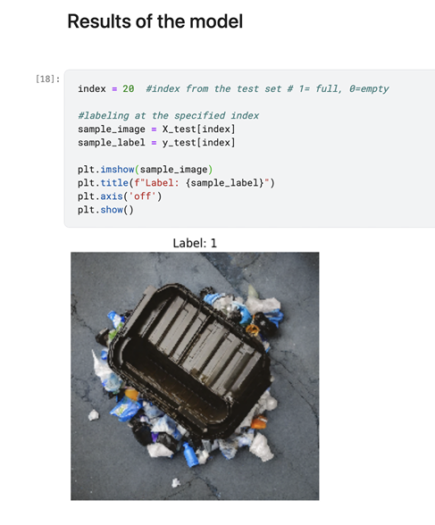
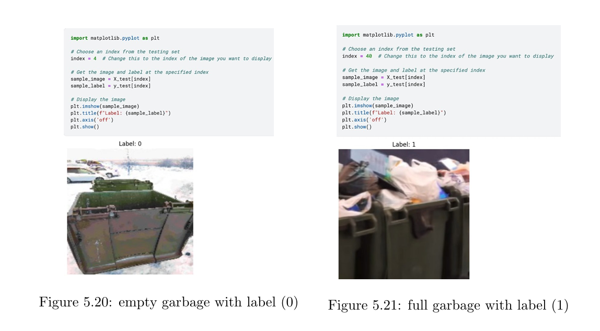

# 🛰️ Automated Detection of Visual Pollution Using Drones

This project presents a computer vision system designed to detect visual pollution in urban environments using aerial images captured by drones. The model automatically identifies elements like garbage, construction debris, or excessive signage that contribute to visual clutter.

---

## 🧠 Project Overview

Visual pollution, though often overlooked, impacts urban aesthetics and mental well-being. This project builds an automated pipeline for detecting such pollution using drone footage and deep learning techniques.

---

## ⚖️ Technologies Used

- Python  
- TensorFlow / Keras  
- OpenCV  
- NumPy / Pandas  
- Jupyter Notebook  

---

## 📂 Dataset

A custom dataset was collected using drone imagery of various city zones. Images were manually labeled into:
- `Polluted` (e.g., trash, clutter, illegal signs)
- `Clean` (normal/green areas)

Preprocessing steps:
- Image resizing and normalization  
- Data augmentation: flipping, rotation, lighting adjustments  

---

## 🧠 Model Architecture

- **Base Model**: MobileNetV2 (transfer learning)  
- **Input Size**: 224x224 RGB  
- **Training Split**: 80% train / 20% validation  
- **Optimizer**: Adam  
- **Loss**: Binary Crossentropy  

---

## 📊 Results

| Metric    | Value |
|-----------|-------|
| Accuracy  | 87%   |
| Precision | 85%   |
| Recall    | 89%   |
| F1-Score  | 87%   |

---

## 🖼️ Sample Output

### 📋 Part of the model code output in classifying the images

### 🧠 Model Predictions Example  

